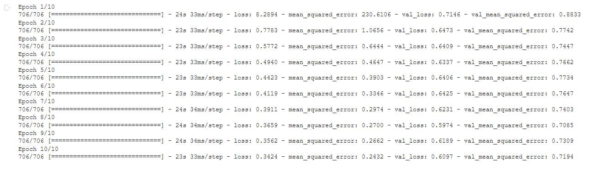
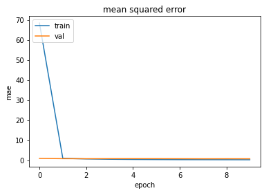
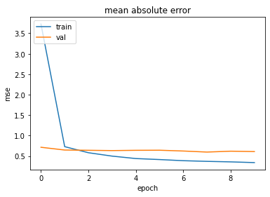

# User geolocalization usuing tweets in german language
Deep Learning model to predict the latitude and longitude of users using tweets in german language


## 1. Cleaning the dataset

While writing on social media, people usually make lots of grammar mistakes, use slang or emojies, or even write sequences of characters which make the process of learning very hard for any machine learning model. Therefore, the dataset needed to be formated in a way a model can "understand".

- The first step was to use a tokenizer specially created for tweets implemented in the nltk library: TweetTokenizer(). Other tokenizers such as WhitespaceTokenizer or wordpunct_tokenize performed worse on the given dataset. The TweetTokenizer tokenizer correctly split the text separating individual words from emojies, special characters, puntuation, or hastags. 
- The characters were then all lowered, because words such as "This" and "this" should be treated as the same one. 
- Emojies are represented as a sequence of letters and numbers, so in order to get rid of them, a regex was used to eliminate all words containing any number. By doing so, I have also eliminated words such as "b4" or "w8" that are very hard to transform to their original form: "before" and "wait". 
- The next step was to eliminate all the punctuation from all the tweets, as people use excessive punctuation on social media to express their feelings. 
- Then, all the words that were considered among the most common ones in german language were eliminated. Moreover, words with a length higher than 2 were taken into consideration as german languange contains almost no proper word that has less than 3 letters. For this step, the stop words from the nltk library were used. 
- After appling all these restrictions, the final matter was implemented: stemming all the current words, which means reducing each word to its root form. 


## 2. Creating the vocabulary and the features

In order to map every word, their unique id was computed, creating a vocabulary. The first step in doing so was to compute the frequency of each word, which was stored in a dictionary. By doing this, I was able to filter words that appear less than a certain threshold in the entire dataset. Even though when this threshold was set to eliminate words that appear less than 10 times, there was still words such as: "aaaah" or "heelloo". However, the designed model performed best when the threshold was set to eliminate words that appear only once. 

By filtering the most unused words, I created the vocabulary, by assigning a certain id to every word. One thing that needs to be mentioned is that the vocabulary was created only based on the train dataset, the validation and test sets being transformed according to it.  

The final chosen method to create the features was the bag of words one, by transforming each tweet into a row of 0's and 1's, having the length equal to the length of the vocabulary, and having 1 where the id corresponding to the specific ward was. 

I have also tried to use CountVectorizer and TfidfVectorizer from the sklearn library, that would automatically create the bag of words and the vocabulary, but both resulted in a dataset that had huge loss on validation data. By writing the functions manually, the problem was solved.

<div style="page-break-after: always;"></div>

```python
def get_features(data_train, data_validation, data_test):

  vectorizer = CountVectorizer(
      strip_accents = 'ascii',
      min_df = 10,
      lowercase = False,

  ) 
  # create the CountVectorizer instance with the above parameters. The words do not need to be lowered again, keep the words that have a minimum of 10 apparitions among all documents, strip_accents = 'ascii' used for character normalization
  vectorizer.fit(data_train)  # fit the vectorizer only on the training set
  features_names = vectorizer.get_feature_names() # get the features name for later examination
  vocab = vectorizer.vocabulary_ # get the created vocabulary

  X_train = vectorizer.transform(data_train) # transform the vectorizer for each data set
  X_validation = vectorizer.transform(data_validation)
  X_test = vectorizer.transform(data_test)

  # transform the elements in arrays to be easily manipulated

  X_train = X_train.toarray() 
  X_validation = X_validation.toarray()
  X_test = X_test.toarray()

  return X_train, X_validation, X_test, features_names, vocab
```

Moreover, word embedding was also tried on the data, transforming each word in its equivalent in the vocabulary and padding each sentence until the maximum number of words from any sentences is met. 

```python
  max_length = 84 # the longest sentance has 84 words
  aux_df = []
  for i in range(len(df.index)):
    if i % 5000 == 0 or i == len(df.index)-1:
      print("Creating features from line {} out of {}".format(i, len(df.index)))
    aux_line = []
    for word in df.iloc[i]['text_cleaned']:
      if word in vocabulary:
        aux_line.append(vocabulary[word])
    aux_df.append(aux_line)

  features = pad_sequences(aux_df, maxlen=max_length, padding='post')
```
<div style="page-break-after: always;"></div>

By normalizing the features I have observed no improvement in the selected model.

```python
from sklearn.preprocessing import Normalizer
scaler = Normalizer(norm='l1') 
scaler.fit(X_train)
X_train = scaler.transform(X_train) 
X_val = scaler.transform(X_val)
X_test = scaler.transform(X_test)
```

## 3. Applying the chosen model

By transforming the data above created into numpy arrays and by selecting the targets, the next step was to implement a Deep Learning model. The model that resulted in the best score is composed of one input layer, 3 hidden layers and one output layer. All the layers are Dense and have 'relu' as activation function. The input layer has 256 neurons, the hidden layers have 256, 128 and 64 neurons respectively and the output layer has 2 neurons, one for each output. 

```python
model = tf.keras.models.Sequential([
  tf.keras.layers.Dense(256,input_shape = (documents_length,), activation='relu'), # Dense layer with 256 neurons
  tf.keras.layers.Dense(256, activation='relu'), # Dense layer with 256 neurons
  tf.keras.layers.Dense(128, activation='relu'), # Dense layer with 128 neurons
  tf.keras.layers.Dense(64, activation='relu'), # Dense layer with 64 neurons
  tf.keras.layers.Dense(2, activation='relu') # Dense layer with 2 neurons
])
```
By experimenting with various variables, I have seen that deeper models with 512 or 1024 neurons would not provide a better loss than the above model. Moreover, the number of hidden layers was chosen by observing their impact on the loss, being added one by one.

Other more complex layers were on the embedded matrix. The input dimension had the length on the vocabulary, the output dimension was set to 64 and the input length was set to the length of any tweet as they have the same size. 

```python 
model = tf.keras.models.Sequential([
  tf.keras.layers.Embedding(input_dim=vocab_size, output_dim=64, input_length=documents_length), 
  tf.keras.layers.Bidirectional(tf.keras.layers.LSTM(50)), # trains two LSTM models: the first one as it is (forward) and the second one reversed (backwards)    
  tf.keras.layers.Dense(2, activation='relu') # output layer
])
```

Models such as SVR, LinearRegression, RidgeRegression, Lasso, XGBRegressor were also tried. LinearRegression, RidgeRegression and Lasso resulted in a $R^2$ score of 0.001 on the training data showing that the models were not capable of learning something. 

On the other hand, SVR and XGBRegressor were able to learn the data, but after tuning the parameters, they failed to go under the pre-set threshold of 0.89. 

Below there are some models that I have implemented

```python
model = MultiOutputRegressor(SVR(
    kernel = 'rbf', # also tried 'linear' and 'poly'
    verbose = True, # verbosity level
    cache_size = 500, # cache size
), n_jobs = -1)
```


```python
model = MultiOutputRegressor(XGBRegressor(
    n_estimators=1000, # number of estimators that are to be used
    max_depth=20, # maximum depth of a tree
    learning_rate=0.1, 
    verbosity=2, 
    n_jobs=-1, # number of parralel multiprocessors
    random_state = 42 # random seed
), n_jobs=-1)
```


## 4. Evaluating the model

The selected optimizer was Adam as it showed the best results (compared to SGD or AdaGrad), with a learning reate of 0.001. The loss which needed to be minimized was Mean Absolute Error and the chosen metric was Mean Squared Errod. By fitting the model for 5 epochs on the training data and validating it on the validation data, the results shown below are provided. In order not to fit the entire dataset in one go, the batch parameter was used of size 32. 



The model was trained for maximum 10 epochs as more of them would result in overfitting (training loss would decrese while validation loss would stay almost the same). 






<div style="page-break-after: always;"></div>
